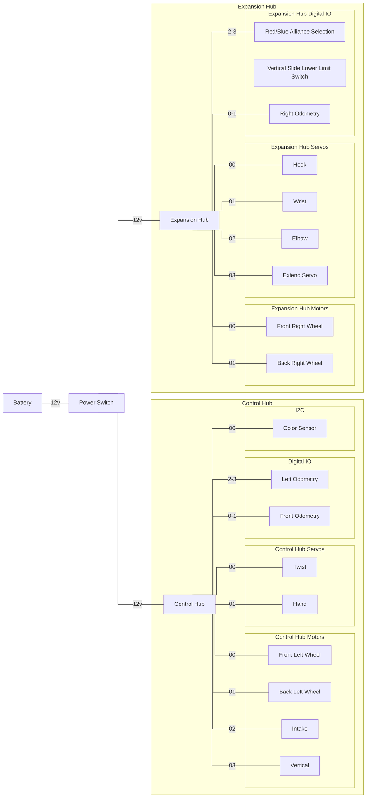

```mermaid
%%{init: {"flowchart": {"curve": "step"}}}%%

flowchart LR

EH[Expansion Hub]
CH[Control Hub]
Bat[Battery]
SW[Power Switch]

Bat -- 12v --- SW
SW  -- 12v --- EH
SW  -- 12v --- CH


subgraph Control Hub
    subgraph Control Hub Motors
        M2[Front Left Wheel]
        M4[Back Left Wheel]
        M5[Intake]
        M6[Vertical]
    end

    subgraph Control Hub Servos
        S5[Twist]
        S6[Hand]
    end

    subgraph Digital IO
        ENC2[Left Odometry]
        ENC3[Front Odometry]  
    end

    subgraph I2C
        I2C1[Color Sensor]
    end

CH -- 00 --- M2
CH -- 01 --- M4
CH -- 02 --- M5
CH -- 03 --- M6

CH -- 0-1 --- ENC3
CH -- 2-3 --- ENC2

CH -- 00 --- I2C1

CH -- 00 --- S5
CH -- 01 --- S6


end

subgraph Expansion Hub
    subgraph Expansion Hub Motors
        M1[Front Right Wheel]
        M3[Back Right Wheel]

    end

    subgraph Expansion Hub Servos
        S1[Hook]
        S2[Wrist]
        S3[Elbow]
        S4[Extend Servo] 
    end

    subgraph Expansion Hub Digital IO
        SW1[Red/Blue Alliance Selection]
        SW2[Vertical Slide Lower Limit Switch]
        ENC1[Right Odometry]
    end

EH -- 00 --- M1
EH -- 01 --- M3

EH -- 00 --- S1
EH -- 01 --- S2
EH -- 02 --- S3
EH -- 03 --- S4

EH -- 0-1 --- ENC1
EH -- 2-3 --- SW1

end
```
